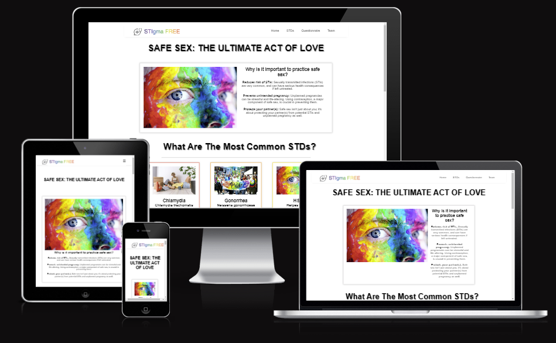
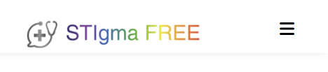
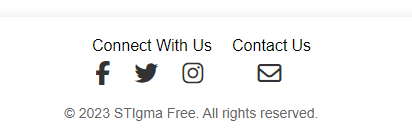
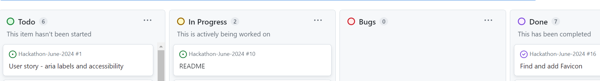
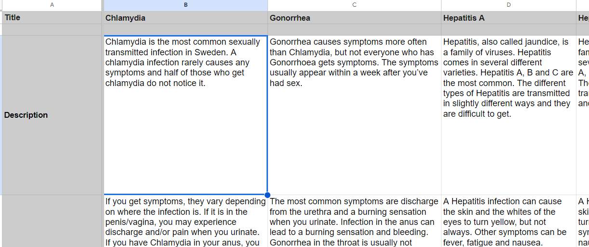
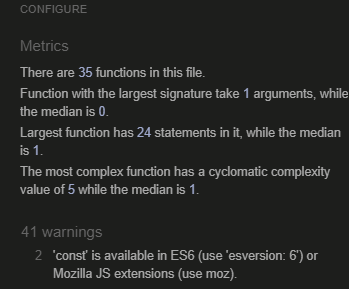
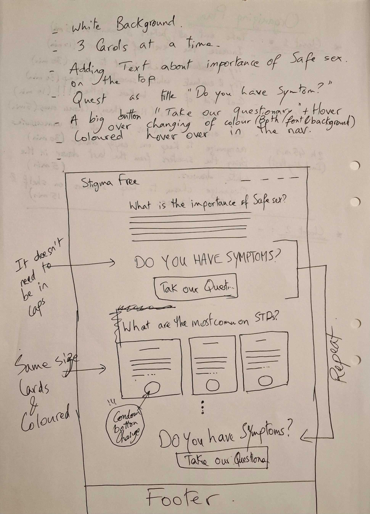
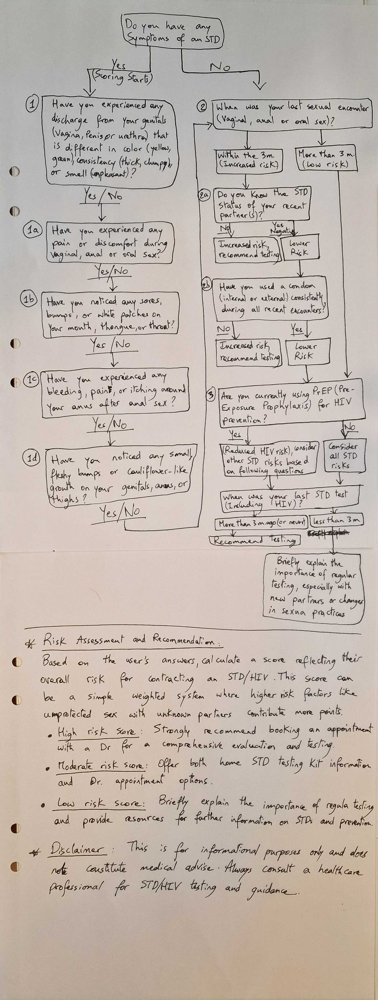
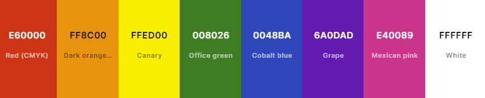

# June-2024-Hackathon
- StIgma Free is an app to read and interact related to sexual health, the first version of the app will be related to sexually transmitted diseases.
- You will be able to read about the diseases, be able through thoughtfully choosen question see if you are at a risk of having a disease and recommended measures.
- You will be able to be anonymous or register to get more help, you will be able to get suggestions related to both health professionals and tests, but we are not a doctors clinic so we will not suggest treatments.

## Meet the Development Team
* [Jad Nehmeh](https://www.linkedin.com/in/jnehmeh/)
    * Scrum Master, Code Institute Alumni.*
* [Johan Plym Arkert](https://www.linkedin.com/in/johan-plym-arkert/)
    * Code Institute Student.*
* [Stephanie Bell](https://www.linkedin.com/in/stephanie-bell-529a362b/)
    * Code Institute Student.*
* [Amir Shkolnik](https://www.linkedin.com/in/amirshkolnik/)
    * Code Institute Student.*
* [Sophie Tigerholm](https://www.linkedin.com/in/)
    * Code Institute Student.*
* [Alexander Åberg](https://www.linkedin.com/in/alexander-åberg)
    * Code Institute Student.*

---
**TABLE OF CONTENTS**
* [USER EXPERIENCE](#UX)
    * [Visitor Goals](#visitor-goal)
    * [Business Goals](#business-goals)
    * [User Stories](#user-stories)
* [Existing Features](#existing-features)
    * [Page Layouts/Features](#page-related-1)
    * [Page Layouts/Features](#page-related-2)
    * [Page Layouts/Features](#page-related-3)
    * [Page Layouts/Features](#page-related-4)
    * [Page Layouts/Features](#page-related-etc.)
* [Thoughts behind our choices](#thoughts-being-our-choices)
* [Database](#database)
* [Features Left to Implement](#features-left-to-implement)
* [Testing](#testing)
    * [Validator Testing](#validator-testing)
    * [Unfixed and fixed Bugs](#unfixed-and-fixed-bugs)
* [Quality Score through Google Devtools Lighthouse](#quality-score)
* [Deployment](#deployment)
* [Credits](#credits)
* [Content](content)
* [Media](#media)
* [Wireframe](#wireframe)
* [Flowchart](#flowchart)
* [Technologies Used](#github-projects)
* [Colours & Text](#colours-text)
* [Agile](#agile)
* [Kanban](#kanban)
* [Future Development, Iteration and Implementation](#future-development-iteration-and-implementation)
* [Technologies Used](#technologies-used)
    * [Languages Used](#languages-used)
    * [Frameworks Used](#frameworks-used)
    * [Databases Used](#databases-used)
    * [Libraries and Packages Used](#libraries-and-packages-used)
    * [Programmes and Applications Used](#programmes-and-applications-used)
* [Data Structure](#data-structure)

---

# UX
### Visitor Goals
The expected visitor is:
- Visitors that wants to understand more about sexual health and sexual transmitted diseases and infections.
- Visitors that believe that they or someone else has a sexual transmitted disease or infection.
- Visitors that wants to get a suggestion about the next step for their sexual transmitted diseases and infections.

Visitors goals are:
- Read facts about the sexual transmitted diseases.
- Go through the quiz to strenghtening or weakening the belief they or others are affected by a sexual transmitted disease or infection.
- Get suggestions what to do including tests and contacting health professionals.

How STIgma Free fills the needs:
- You can get information about different infections.
- You can do a quiz to find out if you have an increased risk of being infected.
- The page is easy to use to get the information you need and you get recommendations to get tests or contact health professionals.

### Business Goals
The Business Goals are:
- Spread awareness of sexually transmitted infections judgement free.
- Get people to be able to contact our partners in the helath care industry.
- If enough people will be aware the bigger chance that we will eradicate the infections.

### User Stories
1. As a person with an active sex life I would want to protect my sexual health.
0. I expect to be able to find out if I am in a risk of having an STI or STD.
0. I will be able to read up on STI's and STD's to prevent it from spreading to me.

### Existing Features

- __Header__
  - Header has a menu with a nav bar or text on bigger screens and the website name in h1.

- __Navigation Bar__

  - The navigation bar can be found on all pages and is fully responsive, it will turn between a bar or buttons depending on the size of the screen.
  - The bar will be visible even if you scroll down. 

- __The landing page images__

  - The landing page or "Home" has a questionnare and some short information about the STI's with a button on each to read more, which will take them to the correct section in the info page. 
  - It also have small pictures for each disease and infection and when you click them you get a bigger version.

- __Info__

  - Info has information about different sexually transmitted infections.

- __Team__

  - The Team page has information about the team, with pictures, short quotes and links to LinkedIn and GitHub.

- __The Footer__ 

  - The footer has contact information and a trademark.

### Thoughts behind our choices

- We wanted to make an inclusive and stigma free site for sexually transmittes infections.
- We used rainbow related colours in a more pastell version to show that we accept everyone and
that we don't judge and the pastell version is to make it friendlier and more open to the eyes.
- Our direction to LGTBQI+ is because the community is more stigmatized and therefore less likely
to find out about infections in time.

### Agile
- We have worked agile to be able to adjust and fix issues that need to be prioritized.
- High level of open communication mainly through slack.
- The scope has changed during the course of the project according to the agile philosophy of it being most important with a good enough functioning product.

### Kanban
- Worked in a Kanban board on GitHub to see where we are with our features in the project.

### Google Sheets

- Data is taken from https://docs.google.com/spreadsheets/d/1WbLvIHAxbtCMGZuvHieJsoPTi4rfxFQwe68zECg8iXQ/edit?gid=0#gid=0
- In the future we want to make the sheet connected to make updates easier

### Features Left to Implement

- We have many ideas for the future, mainly to connect to partners.

## Testing 

-

### Validator Testing 

- HTML
  - No errors were returned when passing through the official [W3C validator](https://validator.w3.org/nu/?showsource=yes&doc=https%3A%2F%2Falexanderaberg.github.io%2Fbattleship%2F#cl177c14).
- CSS
  - No errors but 1 warning were found when passing through the official [(Jigsaw) validator](https://jigsaw.w3.org/css-validator/validator?uri=https%3A%2F%2Falexanderaberg.github.io%2Fbattleship%2F&profile=css3svg&usermedium=all&warning=1&vextwarning=&lang=sv) it got validated as CSS Stage 3 +SVG, the warning I ignore because I want the color and background-color to be the same, because I don't want the text to be seen before clicking a square!
- JS
  - No errors was returned for JS, but 16 warnings, 8 undefined cariables and 3 unused variables when passing through the official [(Jigsaw) validator](https://jshint.com/) I will need to work on them in the future.

### Unfixed and fixed Bugs

- Solved all known bugs.

### Quality Score through Google Devtools Lighthouse

- Lighthouse testing on Chrome Incognito to prevent cookies and background cache to slow down.

## Deployment

- The site was deployed to GitHub pages. The steps to deploy are as follows: 
  - In the GitHub repository, navigate to the Settings tab 
  - From the source section drop-down menu, select the Master Branch
  - Once the master branch has been selected, the page will be automatically refreshed with a detailed ribbon display to indicate the successful deployment. 
  - You can either copy the link for Code or Open in a new repository or see the live version under Deployment to the right under github-pages.
  - In GitHub you can open every seperate file including html. css. images and even favicons and see the folder structure.
  - It is possible to check the commit history in github-pages under Deployment to the right

  - Link to the live version of the project can be found here: - https://johanplar.github.io/Stigma_Free/ and to the GitHub page here: https://github.com/JohanPlAr/Stigma_Free 

## Credits 

Favicon from  <a href="https://favicon.io/emoji-favicons/rainbow-flag/">Icon by John Sorrentino and open source project Twemoji.</a>

- STI & STD information from 1177, RFSL, NHS and internetmedicin.se

### Content 

- STI & STD information from 1177, RFSL, NHS and internetmedicin.se

### Media

- The photos used on the home is from 

### Wireframe

- Used Balsamiq for Wireframe and pen + paper.

### Flowchart

- Flowchart made with pen and paper

### Technologies Used

- HTML - For how the website with the pages is built and planned 
- CSS - For all the styling
- Images  - 
- Fonts - From Google Fonts
- Icons - From Fontawesome 
- Wireframe - From Balsamiq + Pen & Paper
- Flowchart - Pen & Paper
- Favicons - Icon from Favicon.io
- Mockup - Generated at amiresponsive 
- Rainbow colours inspired by LGTBQI+ community but made pastell to make them friendlier to the eyes
- Google Devtools to check responsiveness and to check Lighthouse for Accessibility
- GitHub for storing the project and deploying it
- Gitpod and Codespaces for project development
- Slack for communication with the team
- Google Sheets for information

### Colours & Text

- Did choose pastell colours that is colourfull according to rainbows
- The colour for About Tea is pastel colour to make it friendlier to the eyes compared to sharp colours, the white and black doesn't really exist as pastel so I tried to make them friendlier also which you can see on the colours and in the css picture below.
- Used Font style that is seperate between the logo, h1 and h2 compared to h3 and text with backup font for browsers without the font, the text colour in general is supposed to fit very well with the background colours.

